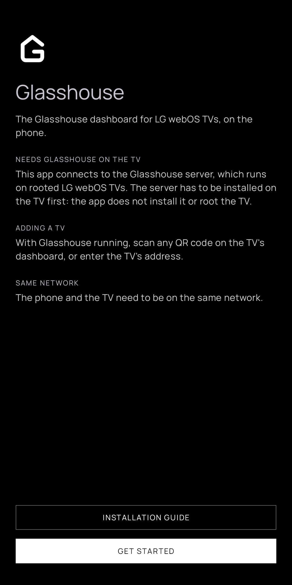
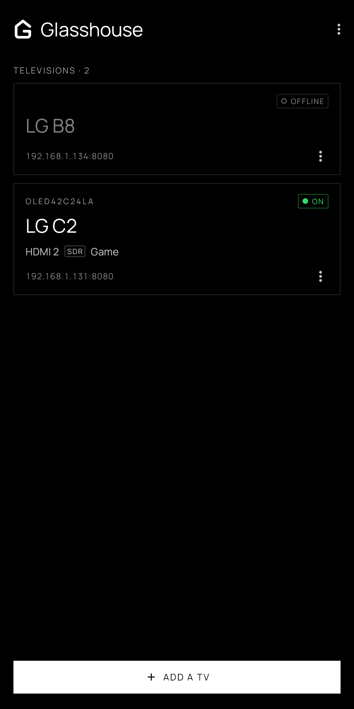
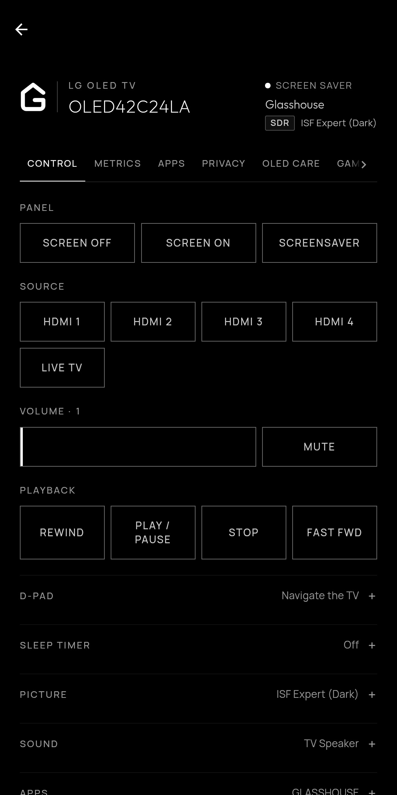
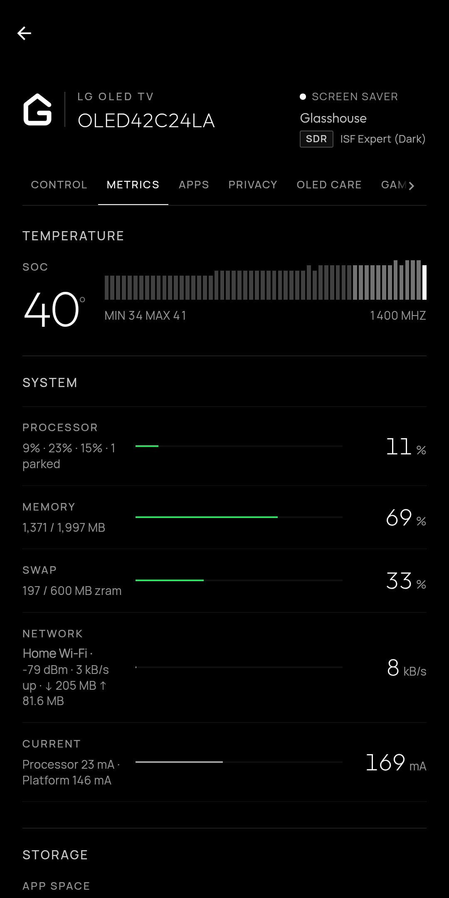
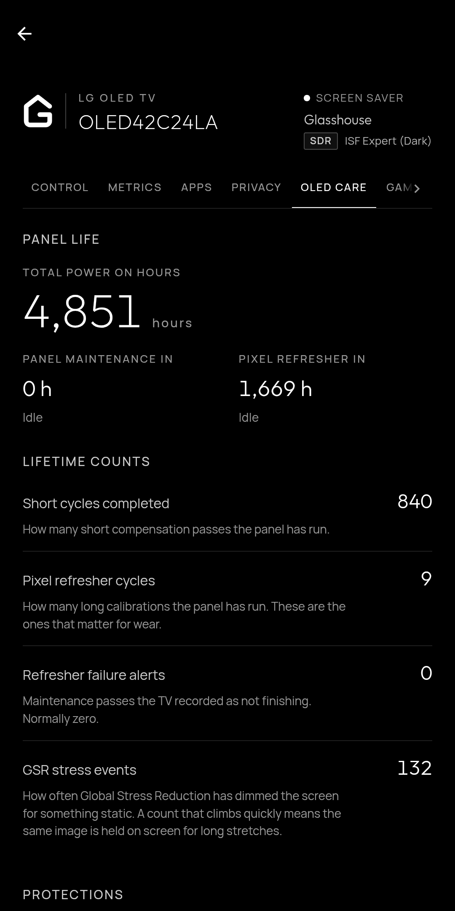

# Glasshouse for Android

A phone app for [Glasshouse](https://github.com/rorygallagher2024/lg-webos-dashboard),
the dashboard for rooted LG webOS TVs. It keeps a list of TVs and opens each
one's web dashboard full screen. The dashboard itself is the same page a browser gets;
the app adds the list with each TV's online status, turning a TV on, and the
file picker the sideload tab needs. It runs on Android 10 and later.

On first launch an introduction explains that the TV needs the Glasshouse
server installed, with a link to the
[installation guide](https://rorygallagher2024.github.io/lg-webos-dashboard/install/).
The About screen links to the source, the documentation and the
[privacy policy](PRIVACY.md).

The app follows the dashboard's look: monochrome, Manrope type, and black or
light grey to match the phone's theme. On a TV's dashboard the header and the
navigation bar take the page's own background, so they follow the dashboard's
theme setting too.

<p align="center">
  
  
  
  
  
</p>

## Adding a TV

Scanning any QR code on the TV's dashboard adds that TV, token included: the
codes are links to the web dashboard and carry `k=<token>` when one is set.
Scanning a TV already in the list updates its token. A TV can also be added by
address; a bare host gets the server's default port, 8080.

A third way, Find TVs on this network, lists the Glasshouse TVs that answer
and are not in the list yet, named as the TV names itself. It sends an SSDP
search, which LG TVs answer naming webOS, and asks every address on the
phone's subnet (its /24 at most) too, for a TV that does not answer SSDP. A TV
with a token set answers "bad or missing token", which still identifies it;
the saved tokens are tried on it, and failing those its QR code supplies one.

Once a TV answers, the app keeps the MAC address it reports in `/api/stats`.
A TV that has moved to a new address is recognised by it. While a saved TV
with a known MAC is offline, the app runs the SSDP search at most every two
minutes, and a TV whose MAC matches takes its new address, keeping its name
and token. Scanning its QR code again, or adding it by the new address, does
the same. A fixed address for the TV on the router avoids the move altogether.

The list, tokens included, stays in the app's private storage and is left out
of Android backups and phone-to-phone transfers.

## Turning a TV on

A TV can answer while dark: in Active Standby finishing panel maintenance,
held there by Always-on, showing Always Ready, or with its screen off. The
list shows such a TV with the server's name for the state and a ring rather
than a dot, and a power button; turning it on asks the server's own `powerOn`.

A TV that does not answer is off or in plain standby. If its MAC is known, it
gets the power button too, and a Turn on button in place of its dashboard.
Both send Wake-on-LAN to the phone's subnet broadcast, the all-ones broadcast
and the TV's last address, every five seconds for up to a minute, until the
server answers. The TV only listens with "Turn on via Wi-Fi" ("Mobile TV On"
on older models) switched on; the app reads that setting while the TV is on
and says so when it is off.

## Local network permission

Android 17 asks before an app reaches devices on the local network. The app
asks on launch; refused, the list shows a banner to ask again, which opens the
app's settings once Android stops showing the prompt.

## Building

```sh
./gradlew testDebugUnitTest assembleDebug
```

The APK lands in `app/build/outputs/apk/debug/`. The `android`
workflow builds the same on every push and pull request and keeps the APK as an artifact. Those builds are signed with each runner's own
debug key, so a newer one only installs after the older one is uninstalled,
which clears its list.

## Releasing

Release builds are signed with the Play upload key. Locally, a
`keystore.properties` beside this README names it (the file and any keystore
are gitignored):

```properties
storeFile=/path/to/upload.jks
storePassword=…
keyAlias=upload
keyPassword=…
```

`./gradlew bundleRelease` then writes the bundle for Play to
`app/build/outputs/bundle/release/`.

The `release` workflow does the same on GitHub, from the secrets
`UPLOAD_KEYSTORE_BASE64` (the keystore, base64-encoded),
`UPLOAD_KEYSTORE_PASSWORD`, `UPLOAD_KEY_ALIAS` and `UPLOAD_KEY_PASSWORD`.
Pushing a tag `v<versionName>` builds the bundle and an APK (named
`-sideload.apk`) and attaches both
to a GitHub release; the tag must match `versionName`, and `versionCode` must
go up with every upload to Play. Running the workflow by hand builds the same
files as an artifact without a release.

## Store listing

`play-store/` holds the Play listing's graphics: the 512 px icon (from
`icon.svg`), the 1024×500 feature graphic (rendered from
`feature-graphic.html`, which uses the app's own fonts), and the phone
screenshots at 1080×2160, the longest Play accepts at that width.

## Platform notes

The dashboard is plain HTTP on a LAN address, so the network security config
allows cleartext everywhere: a domain list cannot name every private address.

Links to other sites open in the phone's browser; only the TV's own origin
stays in the app. The app adds `Glasshouse-Android/<version>` to the WebView's
user agent.

A TV's dashboard is full screen: the system bars are hidden until swiped in
from an edge. The only control is a back button in the strip beside the
camera cutout, space the page could not use; on a screen without a cutout the
strip is the button's height. Switching TVs is done from the list.

Pulling down at the top of a dashboard reloads it. A TV behind HTTPS with a
certificate the phone does not trust is reported as such rather than as
offline; the page is never loaded past a certificate error, since it would
carry the token.

WebView timers are paused while the app is in the background, which stops the
dashboard's polling.
